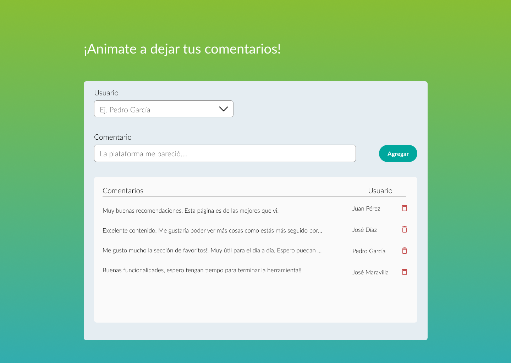

# Agropro React challenge

Este ejercicio se basa en reproducir una pantalla usando React y brindar la funcionalidad que se solicita en las historias.

La aplicación se basa en una tabla para ver y agregar comentarios eligiendo el usuario que realizó el comentario de un dropdown. Se debe maquetear lo mejor posible la siguiente pantalla:



## **Instrucciones**

Se debe clonar o forkear el repositorio para trabajar sobre el mismo y, una vez resuelto, se deben subir los cambios a un repositorio propio.<br> ¡No te olvidés de compartirnos el link a tu repo!

*Acordate que al hacer un git fork, se crea un repositorio propio del challenge y al resolverlo **¡te suma ejercicios a tu portfolio!***

*Si clonas el repositorio, creá una rama nueva mediante*```git checkout -b <branch_name>```

Cuando tengas el repo listo
- Instalá las dependencias del proyecto mediante ```npm install```. Se pueden agregar los paquetes que creas necesarios para lograr la funcionalidad deseada.

- Iniciá la aplicación en modo develop con ```npm start``` para ver los cambios que vayas haciendo y para poder probar tu aplicación.

## **Historias de usuario**
A continuación se enumeran las funcionalidades que se deben lograr:

- Al iniciar la aplicación, se deben cargar en la tabla 15 comentarios desde una REST API (ver Recursos).
- La lista de usuarios se debe cargar dinámicamente con paginación desde una REST API.
- El usuario debe poder agregar un comentario escribiéndolo en el input.
- Se debe poder seleccionar un nombre de usuario de la lista.
- Se debe poder eliminar un comentario de la tabla.
- La lista de nombres de usuarios debe cargar 10 elementos y mostrar de a 5 por vez. Al hacer scroll y llegar al final de la lista, se deben cargar los siguientes 10 usuarios (scroll infinito).
- Al clickear el botón de agregar, el comentario y usuario deben agregarse al principio de la tabla.

### Consideraciones
- Lo que más nos importa es conocerte como desarrollador/a. Por lo que nos parece importante que te animes a desarrollar la lista de usuarios con la funcionalidad de [**scroll infinito**](https://uxplanet.org/ux-infinite-scrolling-vs-pagination-1030d29376f1). Puede dispararse automáticamente o mediante un botón de "cargar más" que aparezca al final de la lista.
- Para cubrir la funcionalidad de scroll infinito se pueden usar las herramientas que creas necesarias.
- Acordate que los usuarios de hoy acceden a nuestras apps desde varios dispositivos por lo que la vista debe ser **responsive** y verse bien como **mínimo** en **Desktop (ancho: 1440px) y mobile (ancho: 360px)**.
- Ya incluímos [Material-UI](https://material-ui.com/) en el proyecto asi que sos libre de probarla! Usá **al menos 2 componentes** de esta librería para familiarizarte con ella!
- Se pueden instalar todas las librerías que creas necesarias para cumplir con la lista de historias.

### Plus
Las siguientes consideraciones serán un plus cuando veamos tu ejercicio:
- **Incluir [Typescript](https://www.typescriptlang.org/)** por poco que sea, si podes sumar algo de TS no dudes en hacerlo!
- **Manejar los errores** siempre es bueno. Los usuarios a veces realizan acciones inesperadas, como intentar agregar un comentario vacío. Si podés tener en cuenta estos casos y protegerte de ellos mostrando los mensajes adecuados al usuario, ellos te lo van a agradecer.
- **Interacciones claras** para mostrar al usuario respuesta en base a sus acciones. Así, por ejemplo, si algo está cargando, el usuario puede esperar y saber que algo está pasando.
- **Modularizar** siempre que veas repetición para poder reutilizar tu código. Por ejemplo, si escribís una función que pensás que podés usar en otros componentes, quizá convenga ponerla en un archivo separado e importarla.
- **Testear** tanto componentes como funciones o hasta interacciones de los usuarios. Incluir cualquier tipo de test para automatizar las pruebas te va a ahorar mucho tiempo.

### Para tener en cuenta
- Siempre pensá que el código va a ser leído por otros/as desarrolladores/as, por eso tiene que entenderse o por sí mismo o mediante comentarios explicativos.
- Si por cuestiones de tiempo creés que no llegas a desarrollar cierta parte del código, podés incluir comentarios explicando como lo harías! (cuando otra persona agarre tu código para implementar lo que faltó, va a ahorrarle mucho tiempo)

## **Recursos** 
### Tipografía: 
- [Lato](https://fonts.google.com/specimen/Lato?query=lato)

### Colores:
- <span style="color: #C44D4D; font-weight: 700">Rojo: #C44D4D</span>
- <span style="color: #00A79D; font-weight: 700">Azul marino: #00A79D</span>
- <span style="color: #E5EDF2; font-weight: 700">Celeste claro: #E5EDF2</span>

### API
Podes usar cualquier REST API pública que conozcas para obtener comentarios y usuarios (tené en cuenta que debe tener paginación)

Te dejamos algunas sugerencias de fake APIs:
- [DummyAPI](https://dummyapi.io/)
- [Mocki](https://mocki.io/fake-json-api)
